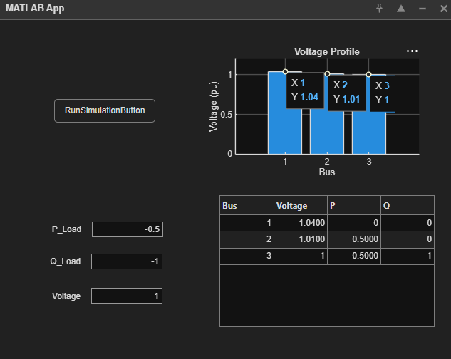
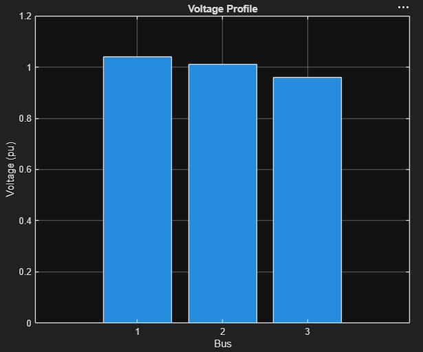
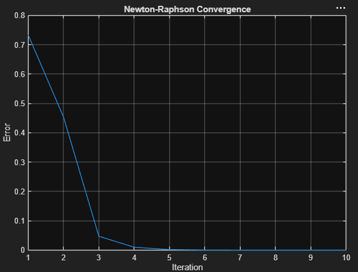

Simulación de Flujo de Carga en Sistema de 3 Barras usando Newton-Raphson en MATLAB

---

Descripción del proyecto

Este proyecto implementa un análisis de flujo de carga en un sistema eléctrico de 3 barras utilizando el método numérico de Newton-Raphson en MATLAB.

El sistema ha sido modelado mediante la matriz de admitancias (Ybus) y resuelto de forma iterativa para obtener los voltajes, ángulos y flujos de potencia en régimen estacionario.

Además, el proyecto incluye una interfaz gráfica desarrollada con MATLAB App Designer para facilitar la interacción con el sistema.

---
Objetivo

El objetivo principal es simular y analizar el comportamiento de un sistema eléctrico de potencia simplificado, obteniendo:

- Perfiles de tensión en las barras
- Ángulos de fase del sistema
- Convergencia del método de Newton-Raphson
- Comportamiento del sistema ante diferentes cargas

---

Metodología

El desarrollo del proyecto se basa en los siguientes pasos:

1. Modelado del sistema eléctrico
- Definición de un sistema de 3 barras:
  - Barra 1: Slack (referencia)
  - Barra 2: PV
  - Barra 3: PQ

2. Formulación del sistema
- Construcción de la matriz de admitancias (Ybus)
- Definición de las ecuaciones de potencia activa (P) y reactiva (Q)

3. Método numérico
- Aplicación del método de Newton-Raphson
- Cálculo del Jacobiano en cada iteración
- Resolución del sistema lineal:
  
  Δx = J⁻¹ · mismatch

4. Iteración
- Actualización de:
  - Ángulos de tensión (δ)
  - Magnitudes de tensión (V)
- Repetición hasta convergencia

---

Resultados obtenidos

🔹 Voltajes en las barras

- Barra 1 (Slack): **1.04 pu**
- Barra 2: **1.01 pu**
- Barra 3: **0.959 pu**

🔹 Ángulos de fase

- Barra 1: **0°**
- Barra 2: **≈ +0.66°**
- Barra 3: **≈ -3.83°**

🔹 Convergencia del método

El método converge en aproximadamente 5 iteraciones:

| Iteración | Error |
|----------|------:|
| 1 | 0.73 |
| 2 | 0.45 |
| 3 | 0.047 |
| 4 | 0.0096 |
| 5 | 0.0016 |

✔ Convergencia estable y decreciente

---

Interfaz gráfica (GUI)

El proyecto incluye una interfaz desarrollada en MATLAB App Designer que permite:

- Introducir parámetros del sistema eléctrico
- Ejecutar la simulación con un botón
- Visualizar resultados en una tabla
- Mostrar el perfil de tensiones en gráficos
- Analizar la convergencia del método

---

Capturas del proyecto

🔹 Interfaz de la aplicación


🔹 Perfil de voltajes


🔹 Convergencia del método


---

Cómo ejecutar el proyecto

1. Abrir MATLAB
2. Ejecutar el archivo:
   ```matlab
   main.m
